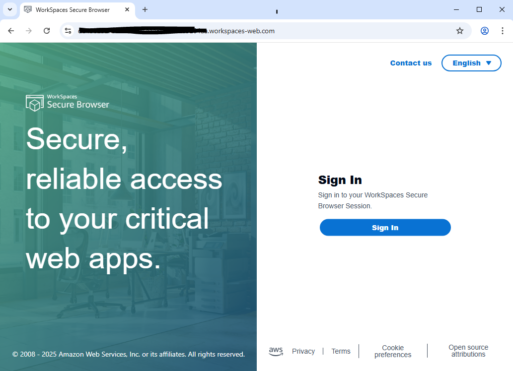
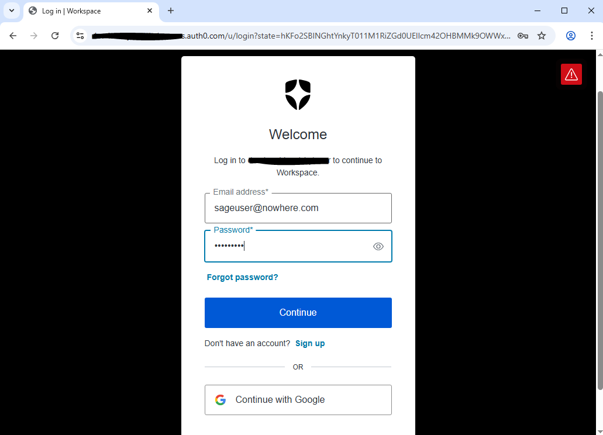
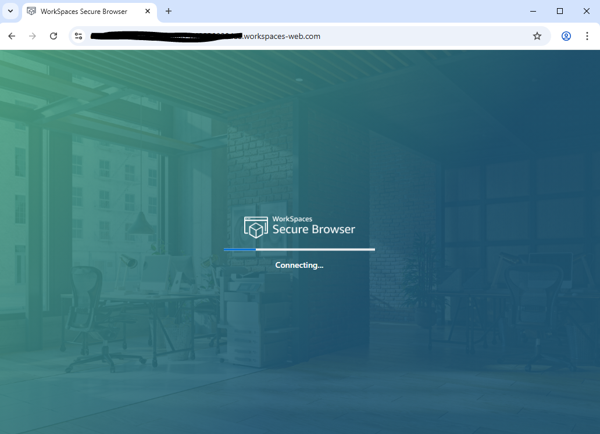
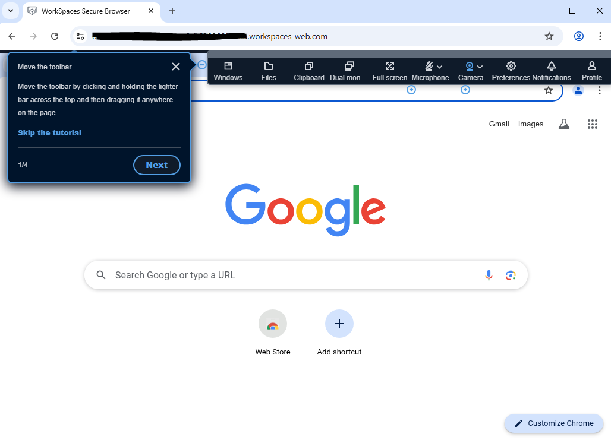
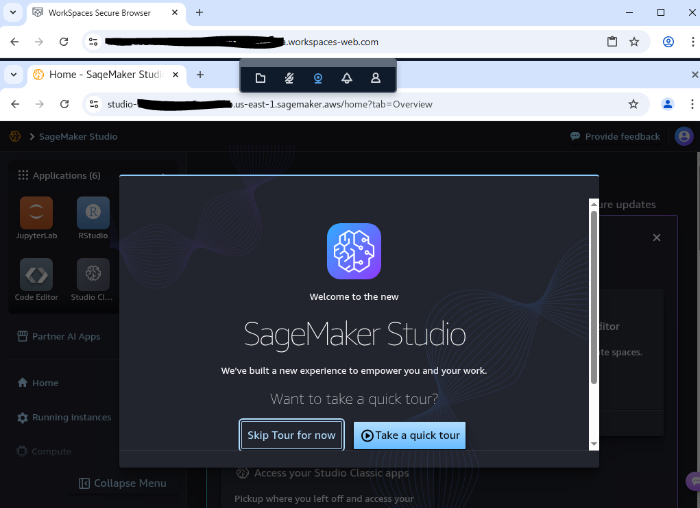
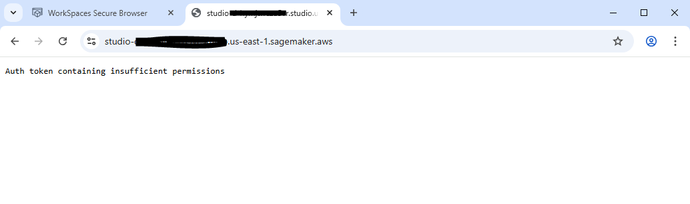

# Use Amazon Workspaces Secure Browser to Secure Access to AWS Services like: Sagemaker Studio, QuickSight, Athena, etc.
It has always been a problem to provide secure access to Amazon resources that has public endpoints.  The user traffic is routed over the public internet which can lead to data breach and proliferation. In this example, we try to mitigate all these using Amazon VPC Endpoints, Source Restrictions and secure access using Amazon Workspaces Secure Browser. Amazon Workspaces Secure Browser is a great product to restrict user accesses and provide a secured tunnel to access browser-based AWS services.  Amazon Workspaces Secure Browser can also restrict access to resources based on specific Ip for corporate user or a group of IPs.

This example focuses on Amazon Sagemaker Studio.  However, it can be easily adopted to implement other AWS Services.

This application integrates with Auth0 for SAML authentication to Amazon Workspaces Secure Browser.  Once user is authenticated, user is then allowed to access the Sagemaker Studio using a Pre-signed url that can only be accessed within the Amazon Workspaces Secure Browser application.

This application is developed using AWS CDK in TypeScript.

## Architecture

## What does it build?
* Creates a Amazon Workspaces Secure Browser portal
    * Integrates with Auth0 for SAML integration
* Setup VPC Endpoint for private network for Sagemaker
* Creates a lambda that will create a presign URL for Sagemaker Studio
* Creates an API Gateway endpoint to expose the Lambda

## Steps to run and test
* Log into your IDP (in this Auth0) and create a SAML application.
* Deploy the CDK code. Wait for the deployment to finish.  It will print out the Amazon Workspaces Secure Browser endpoint for you to use.
* Log back to the Console and copy the SP ACS URL from the portals Identity Provider.
* Log back into your IDP and update the callback URL.
* Start a new browser window and type in the workspace portal URL
  * 
* Once the sign In page is displayed, click on the Sign In button.  It will open the IDP Sign In page.
  * 
* While Authenticated, the following Screen will display
  * 
* Once the Workspace Secure Browser is ready, you will see this
  * 
* Once the Amazon Workspaces Secure Browser is displayed, minimize the menu and type in the SageMaker Studio Domain URL.
  * 

### Non-Workspace example
* Use the same SageMaker Studio Domain URL on a different tab that is not using Amazon Workspaces Secure Browser
  * 

## Considerations
* There are many opportunities to simplify this solution. Please review docs for all the configurations (Browser settings, Data protection settings, etc.) you can perform with Amazon Workspaces Secure Browser.  
* The lambda is not performing any authentication or authorization.  You can re-authenticate with IDP before a pre-signed URL can be created.

## References
* [Amazon Workspaces Secure Browser](https://aws.amazon.com/workspaces-family/secure-browser/)
* [Amazon Sagemaker Unified Studio](https://aws.amazon.com/sagemaker/unified-studio/)
* [Amazon Lambda](https://aws.amazon.com/lambda/)
* [Auth0](https://auth0.com)