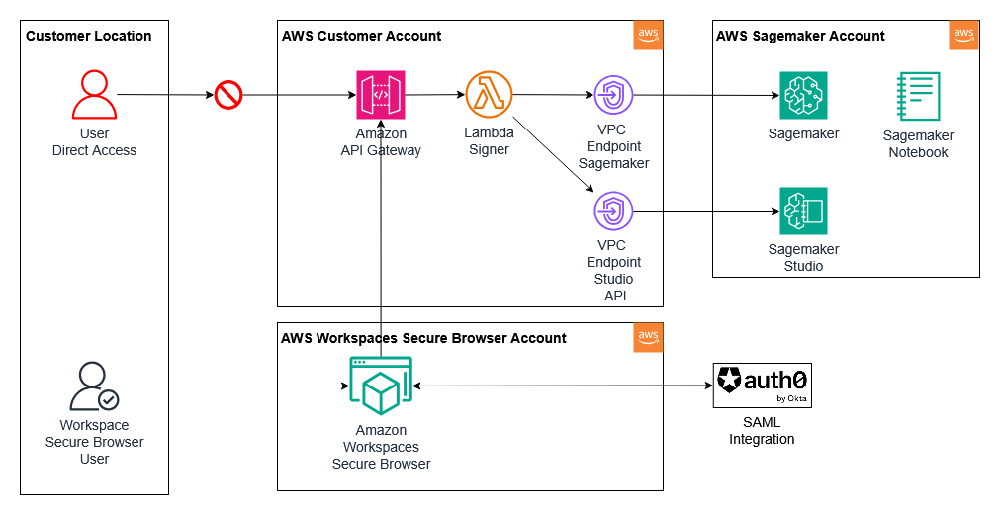

# Use Amazon Workspaces Secure Browser to Secure Access to AWS Services like: Sagemaker Studio, QuickSight, Athena, etc.
It has always been a problem to provide secure access to Amazon resources that has public endpoints.  The user traffic is routed over the public internet which can lead to data breach and proliferation. In this example, we try to mitigate all these using Amazon VPC Endpoints, Source Restrictions and secure access using Amazon Workspaces Secure Browser. Amazon Workspaces Secure Browser is a great product that restricts user access and provides a secured tunnel to access browser-based AWS services.  In addition to logging user Session data, Amazon Workspaces Secure Browser can also restrict access to resources based on specific IP for corporate user or a group of IPs.

Our example implements Amazon Sagemaker Studio with Amazon Workspaces Secure Browser.  However, this example can be easily adopted to implement other AWS Services.

This application integrates with Auth0 for SAML authentication to Amazon Workspaces Secure Browser.  Once the user is authenticated, the user is then allowed to access the Sagemaker Studio using a Pre-signed URL that can only be accessed within the Amazon Workspaces Secure Browser application.

This application is developed using AWS CDK in TypeScript.

## Architecture

## What does it build?
* Creates an Amazon Workspaces Secure Browser portal
    * Integrates with Auth0 for SAML integration
* Sets up VPC Endpoint for private network for Sagemaker
* Creates a lambda that will create a presign URL for Sagemaker Studio
* Creates an API Gateway endpoint to expose the Lambda

## Steps to run and test
* Log into your IDP (we are using Auth0) and create a SAML application
* Deploy the CDK code. Wait for the deployment to finish.  It will print out the Amazon Workspaces Secure Browser endpoint for you to use.
* Log into to the AWS Console and copy the SP ACS URL from the Amazon Workspaces Secure Browser portal's Identity Provider configuration tab
* Go back into your IDP and update the callback URL
* Start a new browser window and type in the workspace portal URL
  * 
* Once the sign In page is displayed, click on the Sign In button.  It will open the IDP Sign In page.
  * 
* After you are authenticated, the Amazon Workspaces Secure Browser loading screen will display
  * 
* Once the Workspace Secure Browser is ready, you will be presented with a Chrome browser
  * 
* Once the Amazon Workspaces Secure Browser is displayed, minimize the Menu and type in the API Gateway endpoint URL
  * 

### Non-Workspace example
* Use the same API Gateway endpoint URL on a different tab that is not using Amazon Workspaces Secure Browser
  * 

## Considerations
* There are many opportunities to simplify this solution. Please review docs for all the configurations (Browser settings, Data protection settings, etc.) you can perform with Amazon Workspaces Secure Browser.
* Amazon Workspaces Secure Browser can record user session events. You can review the logs in Amazon Kinesis Data Stream to support audit requirements.
* The lambda is not performing any authentication or authorization.  You can re-authenticate with IDP and validate the userId before a pre-signed URL can be created.

## References
* [Amazon Workspaces Secure Browser](https://aws.amazon.com/workspaces-family/secure-browser/)
* [Amazon Sagemaker Unified Studio](https://aws.amazon.com/sagemaker/unified-studio/)
* [Amazon Lambda](https://aws.amazon.com/lambda/)
* [Auth0](https://auth0.com)